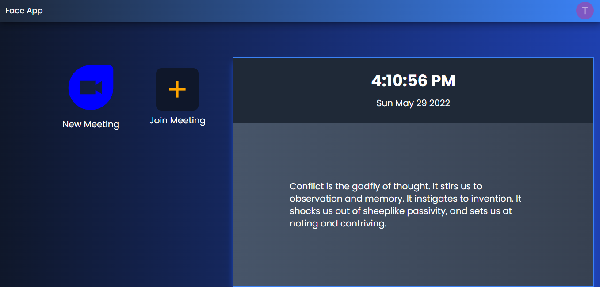
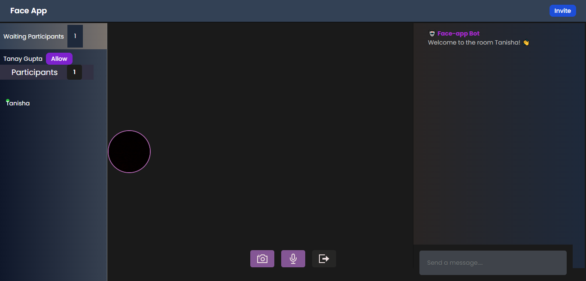
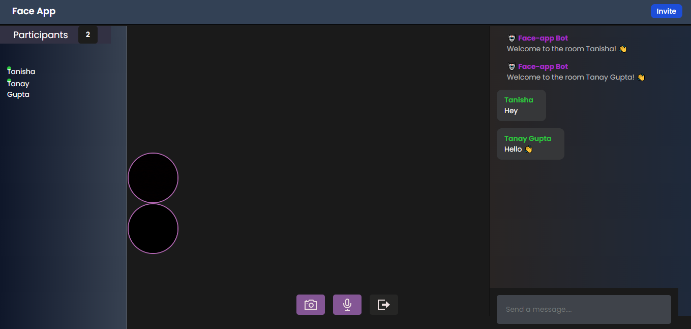
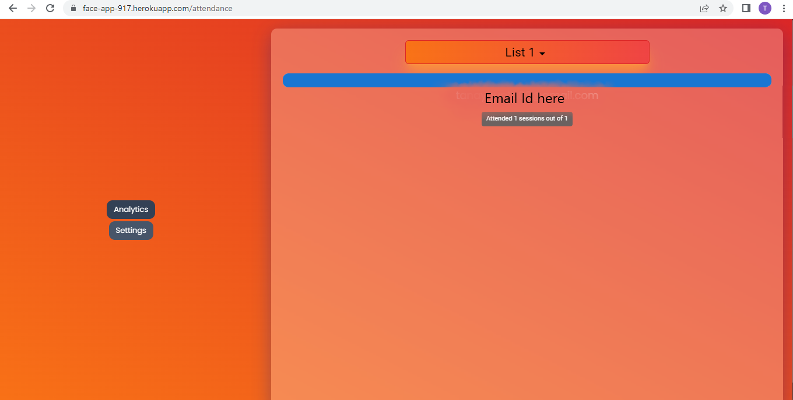

 <h1 align="center">Face App 
</h1>

<p align="center">
 <a target="_blank" href="https://face-app-917.herokuapp.com">Link to the App</a>
</p>
    
<!-- TABLE OF CONTENTS -->
<details open="open">
  <summary>Table of Contents</summary>
  <ol>
    <li>
      <a href="#about-the-project">About The Project</a>
    </li>
    <li>
      <a href="#getting-started">Getting Started</a>
      <ul>
        <li><a href="#prerequisites">Prerequisites</a></li>
        <li><a href="#installation">Installation</a></li>
      </ul>
    </li>
    <li><a href="#navigating-through-the-app">Navigating through the App</a></li><ul>
        <li><a href="#index-page">Index Page</a></li>
        <li><a href="#room">Room</a></li>
        <li><a href="#attendance-portal">Attendance Portal</a></li>
      </ul>
  </ol>
</details>

<!-- ABOUT THE PROJECT -->

## About The Project
* Face Recognition App built during Microsoft Engage 2022 program.
* It is a video call and chat application through which one can use to record an attendance of participants via face recognition.

### Salient Features
* User authentication using Firebase
* Turn on/off your video or microphone and chat with others during the meeting
* Attendance will be taken automatically using face recognition

### Built With
 
* ![Front-end][front-end-shield]
* ![Back-end][back-end-shield]
* ![Tools][tools-shield]

<!-- INSTALLATIONS -->

## Getting Started
To install and run the project on your local system, following are the requirements:
### Prerequisites
Make sure to install the required dependencies via node package manager
```sh
  npm install npm@latest -g
```
### Installation

To separately run the application on your local host, perform the following steps:

Run the following commands to start the server and the client.

```sh
  cd server && npm install && npm start
```

<!-- APP TUTORIAL-->
## Navigating Through The App
### Index Page

After you visit the main url, you will be automatically taken to the login page as you are not logged in. Enter the login credentials and then click the back button and now will be able to create or join a meeting.



### Room

Now, after you click the new meeting button, you will be taken to a new page.



Here you can chat, and communicate with the others




### Attendance Portal 

If the participant's face was recognised according to the dataset provided by the host, then you can check it by leaving the meeting, clicking the profile photo at the index page and clicking the "Visit Attendance Portal" button.



<!--MARKDOWN LINKS-->
[front-end-shield]: https://img.shields.io/badge/Front--End-React.js%2C_Material--UI%2C_Tailwind_CSS-2ea44f
[back-end-shield]: https://img.shields.io/badge/Back--End-Node_JS%2C_Express%2C_socket.io-2ea44f
[tools-shield]: https://img.shields.io/badge/Tools-Agora-2ea44f